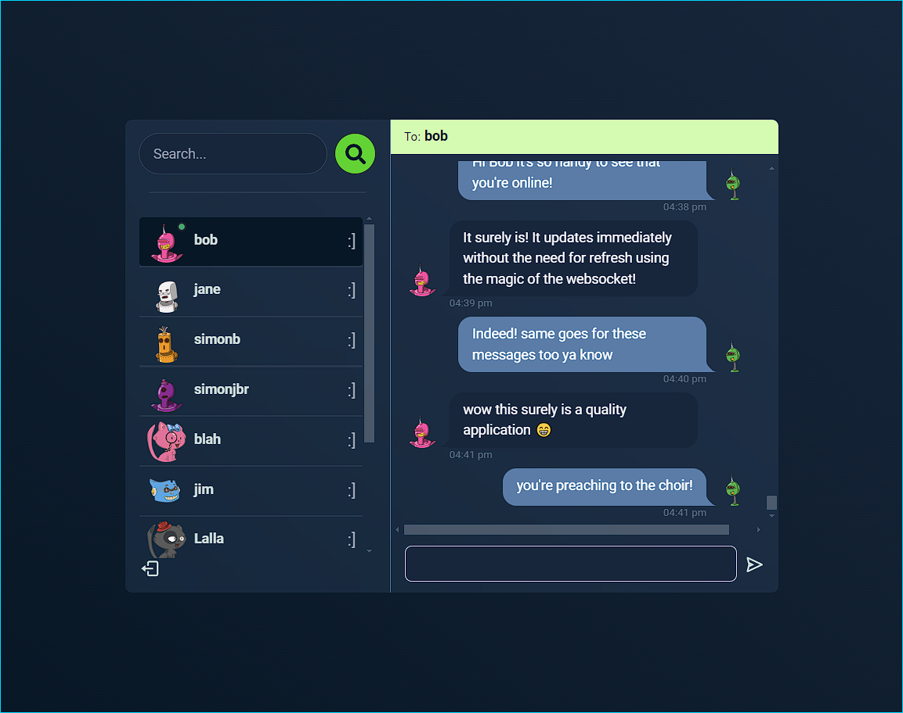

# vivoChat

## Description

vivoChat is an instant messaging web application built on the MERN stack that utilises GraphQL for API and GraphQL Subscriptions for websocket

## Table of Contents

-   [Installation](#installation)
-   [Usage](#usage)
-	[Technologies](#technologies)
-   [Credits](#credits)
-   [License](#license)

## Installation

In order to run the application the user must have [node.js](https://nodejs.org/en/download/current) installed. Then the user must install dependencies by running `npm install` in the root directory of the repository.

The user must also create a `.env` based on the `.env.EXAMPLE` and define each environment variable.

Alternatively `npm run build` can be run to install dependencies as well as produce a bundled client distribution in `/client/dist`.

## Usage

To start the server run `npm run start`.

To start the client (in another terminal) run `npm run client:dev`

The app will now be running locally at [http://localhost:3000](http://localhost:3000)

Users can now login or create an account. Once logged in a user need simply click on the desired user they wish to talk to and start messaging.

> Deployed application: [https://vivo-chat.onrender.com/](https://vivo-chat.onrender.com/)

Deployed screenshot:

## Technologies

[Node.js](https://nodejs.org/en)

[Express](https://expressjs.com/)

[MongoDB](https://www.mongodb.com)

[mongoose](https://mongoosejs.com/)

[GraphQL](https://graphql.org/)

[Apollo GraphQL](https://www.apollographql.com/)

[bcrypt](https://www.npmjs.com/package/bcrypt)

[cookie-parser](https://www.npmjs.com/package/cookie-parser)

[Dotenv](https://www.npmjs.com/package/dotenv)

[JSON Web Token](https://www.npmjs.com/package/jsonwebtoken)

[React Hot Toast](https://react-hot-toast.com/)

[React Icons](https://react-icons.github.io/react-icons/)

[Zustand](https://zustand-demo.pmnd.rs/)

[Day.js](https://day.js.org/)

## Credits

[simonjbr](https://github.com/simonjbr)

Special thanks to:
[As a Programmer](https://www.youtube.com/@asaprogrammer_) youtube channel for a great chat app tutorial

## License

Please refer to [MIT license](./LICENSE) information in the repository.
